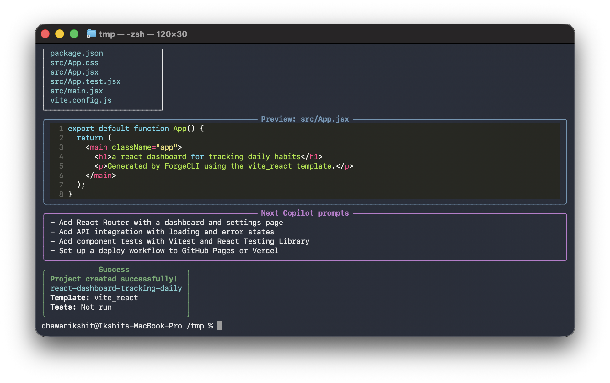
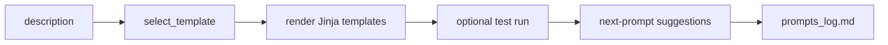

# ForgeCLI

One sentence in, a running project out — with every Copilot prompt logged.



## What it does

- Generates runnable project skeletons from plain-English descriptions.
- Auto-selects a template (FastAPI API, Vite React app, or Rich TUI) from keywords.
- Optionally runs scaffold tests immediately with `--run-tests`.
- Logs each generation prompt plus suggested next Copilot prompts to `prompts_log.md`.

## Quickstart

```bash
pipx install git+https://github.com/idhawan531/forgecli
forgecli generate "a react dashboard for tracking daily habits"
```

No API keys, no config, no network calls — generation is deterministic and works offline.

<details>
<summary>Other install methods</summary>

```bash
# development, from a clone
git clone https://github.com/idhawan531/forgecli && cd forgecli
pip install -e ".[dev]"

# into an existing environment
pip install git+https://github.com/idhawan531/forgecli
```

</details>

| Command | Template |
|---|---|
| `forgecli generate "a rest api for short links"` | `fastapi_api` |
| `forgecli generate "a react dashboard for tracking habits"` | `vite_react` |
| `forgecli generate "a terminal pomodoro timer"` | `rich_tui` |

## Templates

| Key | What you get | Run command |
|---|---|---|
| `fastapi_api` | FastAPI app, pytest test, Python CI workflow | `uvicorn main:app --reload` |
| `vite_react` | Vite + React app, dark-mode starter styling, Node CI workflow | `npm install && npm run dev` |
| `rich_tui` | Typer + Rich terminal app with starter test and Python CI workflow | `python main.py` |

## Transparency

ForgeCLI writes every generation event to `prompts_log.md` and shows a **Next Copilot prompts** panel after scaffolding.

```text
## 2026-09-11 20:00:00
- Description: a rest api for short links
- Template: fastapi_api
- Suggested next prompts:
  - Add a POST /items endpoint with a Pydantic request model and in-memory storage
  - Add pytest tests covering every endpoint including error cases
```

## How Copilot helped

Placeholder: add your 6 best prompts with:
prompt -> what Copilot produced -> what you fixed.

## Architecture



Built with GitHub Copilot.  
#githubcopilotdaycontest #sweepstakes

Licensed under the MIT License.
