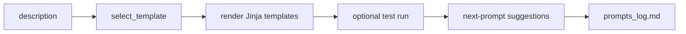

# ForgeCLI

[](https://opensource.org/licenses/MIT) [](https://github.com/features/copilot)

One sentence in, a running project out — with every Copilot prompt logged.


## What it does

- Generates runnable project skeletons from plain-English descriptions.
- Auto-selects a template (FastAPI API, Vite React app, or Rich TUI) from keywords.
- Optionally runs scaffold tests immediately with `--run-tests`.
- Logs each generation prompt plus suggested next Copilot prompts to `prompts_log.md`.

## Quickstart

```bash
pipx install git+https://github.com/idhawan531/forgecli
forgecli generate "a react dashboard for tracking daily habits"
```

No API keys, no config, no network calls — generation is deterministic and works offline.

<details>
<summary>Other install methods</summary>

```bash
# development, from a clone
git clone https://github.com/idhawan531/forgecli && cd forgecli
pip install -e ".[dev]"

# into an existing environment
pip install git+https://github.com/idhawan531/forgecli
```

</details>

`forgecli generate "a rest api for short links"` auto-selects the `fastapi_api` template — see [Usage](#usage) below for every command and flag.

## Usage

The command surface below is generated from the actual `--help` output, so it
cannot drift from the code.

### `forgecli --version` / `-V`

Prints the installed version and exits.

```bash
$ forgecli --version
forgecli 0.1.0
```

### `forgecli generate DESCRIPTION [OPTIONS]`

Scaffolds a new project from a short description.

```text
Usage: forgecli generate [OPTIONS] DESCRIPTION

 Generate project artifacts from a short DESCRIPTION.

╭─ Arguments ──────────────────────────────────────────────────────────────────────────────────────╮
│ *    description      TEXT  A short description of the project you want to scaffold. [required]  │
╰──────────────────────────────────────────────────────────────────────────────────────────────────╯
╭─ Options ────────────────────────────────────────────────────────────────────────────────────────╮
│ --output-dir  -o      TEXT  Directory in which to create the new project folder. [default: .]    │
│ --name        -n      TEXT  Optional explicit project folder name.                               │
│ --template    -t      TEXT  Template key to use. If omitted, forgecli auto-selects one from the  │
│                             description.                                                         │
│ --run-tests                 Run template tests after generation when a test command is defined.  │
│ --help                      Show this message and exit.                                          │
╰──────────────────────────────────────────────────────────────────────────────────────────────────╯
```

```bash
forgecli generate "a rest api for short links" -o ~/code --name links-api --template fastapi_api --run-tests
```

`--run-tests` installs the generated project's own dependencies (into its own
isolated `.venv` for Python templates, or via `npm install` for the React
template) before running its test command — it never touches ForgeCLI's own
environment.

### `forgecli templates`

Lists every registered template with its run command.

```text
Usage: forgecli templates [OPTIONS]

 List available templates and run commands.

╭─ Options ────────────────────────────────────────────────────────────────────────────────────────╮
│ --help          Show this message and exit.                                                      │
╰──────────────────────────────────────────────────────────────────────────────────────────────────╯
```

```bash
forgecli templates
```

### `forgecli demo [OPTIONS]`

Generates one sample project per registered template — a quick way to see
everything ForgeCLI ships without writing a description.

```text
Usage: forgecli demo [OPTIONS]

 Generate one sample project per registered template for a quick look around.

╭─ Options ────────────────────────────────────────────────────────────────────────────────────────╮
│ --output-dir  -o      TEXT  Directory in which to generate demo projects. Defaults to a fresh    │
│                             temp directory.                                                      │
│ --help                      Show this message and exit.                                          │
╰──────────────────────────────────────────────────────────────────────────────────────────────────╯
```

```bash
forgecli demo
```

## Templates

| Key | What you get | Run command |
|---|---|---|
| `fastapi_api` | FastAPI app, pytest test, Python CI workflow | `uvicorn main:app --reload` |
| `vite_react` | Vite + React app, dark-mode starter styling, Node CI workflow | `npm install && npm run dev` |
| `rich_tui` | Typer + Rich terminal app with starter test and Python CI workflow | `python main.py` |

## What a generated project looks like

These are the real file trees produced by `forgecli demo`, not hand-written examples.
Every template ships a `.github/workflows/ci.yml`, so CI runs from the moment the
project is generated.

### `fastapi_api`

```text
fastapi-api/
├── .github/
│   └── workflows/
│       └── ci.yml
├── .gitignore
├── README.md
├── main.py
├── requirements.txt
└── test_main.py
```

### `vite_react`

```text
vite-react/
├── .github/
│   └── workflows/
│       └── ci.yml
├── src/
│   ├── App.css
│   ├── App.jsx
│   ├── App.test.jsx
│   └── main.jsx
├── .gitignore
├── README.md
├── index.html
├── package.json
└── vite.config.js
```

### `rich_tui`

```text
rich-tui/
├── .github/
│   └── workflows/
│       └── ci.yml
├── .gitignore
├── README.md
├── main.py
├── requirements.txt
└── test_main.py
```

## Transparency

ForgeCLI writes every generation event to `prompts_log.md` and shows a **Next Copilot prompts** panel after scaffolding.

```text
## 2026-09-11 20:00:00
- Description: a rest api for short links
- Template: fastapi_api
- Suggested next prompts:
  - Add a POST /items endpoint with a Pydantic request model and in-memory storage
  - Add pytest tests covering every endpoint including error cases
```

## How Copilot helped

ForgeCLI was built almost entirely through GitHub Copilot CLI and Copilot Chat.
Rather than list only the wins, here is what it got right first time and what took
a second pass — the second list is the more useful one.

**Built in one pass: the template architecture.**
A single prompt asking for a Jinja2 template registry — a `Template` dataclass, a
`TEMPLATES` registry, keyword-based `select_template`, and three template packs —
produced working code with a 20-test pytest suite and a CI matrix alongside it.
This is where Copilot genuinely compresses hours into minutes: well-specified,
self-contained structural work.

**Needed a second pass: templates weren't shipping.**
Templates were generated at the repo root and located with
`Path(__file__).parents[2]`. That works under `pip install -e .` and fails under
`pip install .`, because the templates live outside the package and a wheel never
includes them. Fixed by moving them to `src/forgecli/templates_data/` as package
data. Caught by testing a clean, non-editable install — not by reading the code.

**Needed a second pass: a test that always passed.**
The React template shipped `"test": "echo \"No tests configured\" && exit 0"`. The
`--run-tests` flag dutifully reported **Passed**, having tested nothing.

**Needed a third pass: the replacement test never ran.**
Swapping in a real Vitest test was reported as validated — but the validation was
asserting that `package.json` *contained* the strings `vitest` and
`@testing-library/react`. Actually running it gave
`ReferenceError: document is not defined`: `vite.config.js` had no jsdom
environment, so `render()` had no DOM.

**Needed a fourth pass: dependencies were never installed.**
`--run-tests` ran a template's test command in a freshly generated project where
nothing had been installed, so the React template failed with
`vitest: command not found`. The FastAPI template appeared to pass only because
the command resolved to ForgeCLI's own interpreter, which happened to have pytest
and fastapi available. Fixed with a per-template `install_command` and by resolving
the generated project's own venv interpreter for both install and test.

### The pattern worth taking away

Copilot's code quality was consistently good. What failed repeatedly was
*verification* — checking that a file contains the right strings, rather than
executing the thing and watching it work. Every bug above survived a step labelled
"validated" and died the moment something ran.

Prompts ending with "verify by running X and confirm it passes before reporting
done" produced materially different outcomes from prompts ending with "add X". The
last change in this project — tightening the project-name slugs — was the first
where Copilot executed the function to get real outputs before writing the test
assertions, and it also caught two unrelated tests that the change had broken. That
is the habit worth prompting for from the start.

## Architecture



Built with GitHub Copilot.  
#githubcopilotdaycontest #sweepstakes

Licensed under the MIT License.
